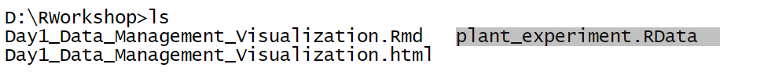

```{r setup, include=FALSE}
knitr::opts_chunk$set(echo = TRUE)
```

## Introduction

### Why `R` for Biology? 

**Reproducible Research**

Biology increasingly relies on data-driven workflows (e.g., genomics, ecology, bioinformatics). `R` enables reproducible science:

- Scripts document every step of analysis (no more "black box" Excel formulas).
- Combine code, text, and results in **`R` Markdown** or **Quarto** for publication-ready reports.
- Critical for peer review, collaboration, and future lab members who need to replicate your work.

**Ecosystem of Biology-Specific Tools**

`R` has unparalleled packages for biological research:

- **Bioconductor:** A repository for genomic data analysis (e.g., RNA-seq, DNA methylation, single-cell sequencing). Example, `DESeq2` for differential gene expression.
- **Phylogenetics:** `ape`, `phyloseq`, and `ggtree` for evolutionary trees and microbiome data.
- **Ecology:** `vegan` for community ecology, `raster` for spatial data.

**Data Visualization**

Biology thrives on clear visuals for complex data:

- **`ggplot2`:** Create publication-quality plots (e.g., heatmaps, PCA plots, boxplots).
- **Specialized plots:** Volcano plots (genomics), NMDS plots (ecology), phylogenetic trees.
- Customizable themes for journal formatting requirements.

**Statistical Power**

`R` is built by statisticians, making it ideal for:

- Hypothesis testing (t-tests, ANOVA, GLMs).
- Advanced modeling (mixed-effects models, survival analysis).
- Bioinformatics tools (e.g., `limma` for microarray data).

**Handling Large, Messy Data**

- `dplyr` and `tidyr` (part of the tidyverse) clean and wrangle data efficiently.
- Read large files (e.g., sequencing data) `faster` with `data.table` or `readr`.
- Avoid Excel’s limitations (row limits, accidental data corruption).


**Open Source & Community-Driven**

- Free for students and labs with limited budgets.
- Active communities (e.g., Bioconductor, Stack Overflow) for troubleshooting.
- Continuous updates and cutting-edge tools (e.g., AI/ML integration via `tidymodels`).

**Integration with Other Tools**

- Use `R` with Python via `reticulate`.
- Connect to databases (SQL) or cloud platforms.
- Automate workflows (e.g., `Snakemake` for pipelines).

### Example Workflow in Biology

1. **Import:** Read counts with Bioconductor’s `tximport`.
2. **Analyze:** Differential expression with `DESeq2`.
3. **Visualize:** Volcano plots with `ggplot2`.
4. **Report:** Generate a PDF with methods, code, and results using `R` Markdown.

### Real-World Success Stories

- The [**Human Microbiome Project (HMP)**](https://www.hmpdacc.org/hmp/overview/) used `R` for data analysis.
- Journals like *Nature and Science* encourage code submission in `R`.
- Many biology labs now require `R` skills for PhD candidates.

### Workshop objectives

- Save and load R objects (`.RData`, `.RDS`).
- Read and write data (CSV, Excel, text files).
- Create effective plots (`base R` and `ggplot2`).

## Saving and Loading `R` Objects

**Why save data objects?**

Biologists often work with:

- Large datasets (e.g., gene expression matrices, ecological survey data).
- Computationally intensive models (e.g., `DESeq2`, phylogenetic trees, machine learning outputs).
- Intermediate results that take hours/days to generate.


**Saving objects avoids re-running analyses** and **ensures reproducibility** when sharing with collaborators.

### Multiple Objects

#### Saving Multiple Objects: `.RData` (or `.rda`)

- **Use Case:** Save your entire workspace or a subset of objects (e.g., processed data, models, plots) for later use.

- `save()`: Save multiple `R` objects (e.g., vectors, matrices, models) into a single `.RData` file. Syntax is
```
save(..., file = "filename.RData", envir = parent.frame())
```

   - `...`: Names of objects to save (e.g., model, data, matrix).
   - `file`: Path/filename for the output.
   - `envir`: Environment to search for objects (usually left as default).


**Example 1:** Saving a Linear Model, Vector, and Matrix

Imagine you’re analyzing the relationship between plant growth and sunlight exposure:
```{r,eval=F}
# biology data
sunlight <- c(2, 4, 6, 8, 10)  # Hours of sunlight per day
growth <- c(1.2, 2.5, 3.1, 4.0, 4.8)  # Plant growth (cm)

# Run a linear model (simple linear regression)
model_GS <- lm(growth ~ sunlight)

summary(model_GS) # check output


# Create a matrix of experimental conditions
experiment_matrix <- matrix(c(1, 2, 3, 4, 5, 25, 30, 35, 40, 45), 
                            ncol = 2, 
                            dimnames = list(NULL, c("Day", "Temperature (°C)")))
```

- To save the entire workspace in the default working directory:
```{r, eval=FALSE}
# Save ALL objects to .RData
save(sunlight, growth, model_GS, experiment_matrix, file = "plant_experiment.RData")
```
- To save the entire workspace in the designated path e.g. `D:/RWorkshop`
```{r, eval=FALSE}
# Save ALL objects to .RData
save(sunlight, growth, model_GS, experiment_matrix, file = "D:/RWorkshop/plant_experiment.RData")
```
We can check our directory and see the saved file 

- To save some multiple objects, say  `sunlight`, `growth` and `experiment_matrix`, and name the file as `PlantData.RData`:
```{r,eval=FALSE}
save(sunlight, growth, experiment_matrix, file = "D:/RWorkshop/PlantData.RData")
```
#### Loading `.RData` or `.rda`

`load()`: Load `.RData` or `.rda` objects  into the current workspace. Syntax is 
```
load(file, envir = parent.frame(),verbose = FALSE)
```

- `file`: Path/filename of the file to load.
- `envir`: The environment where the data should be loaded (usually left as default).
- `verbose`: Should item names be printed during loading? (usually left as default)

If we want to load the saved file from Example 1, we have
```{r}
load("plant_experiment.RData")

# check the objects from the save file
ls()

# check the model output
summary(model_GS)
```

**Caveats:**

- Objects overwrite existing ones in your workspace with the same names.
- Avoid accidentally cluttering your workspace with unneeded objects.

### Single Objects
#### Saving Single Objects

- **Use Case:** Save a single object (e.g., a large phylogenetic tree, a model, a processed dataframe) efficiently.
- `saveRDS()`: Save a single `R` object (e.g., a model, matrix, vector) in a compressed format. Syntax is
```
saveRDS(object, file = "filename.RDS", compress = TRUE)
```

   - `object`: The object to save (e.g., model, matrix, list).
   - `compress`: Reduce file size (default: TRUE).


**Example 2:** Saving a Linear Regression Model

Let's say we are working about Butterfly data
```{r}
# Simulate data: Butterfly wing length vs. body size
body_size <- c(12, 15, 18, 20, 22)  # Body length (mm)
wing_length <- c(25, 30, 35, 40, 45)  # Wing length (mm)

# Run a linear model
butterfly_model <- lm(wing_length ~ body_size)
summary(butterfly_model)
```

To save this model, we have: 
```{r,eval=F}
# Save the model as .RDS
saveRDS(butterfly_model, file = "butterfly_model.RDS")
```

**Example 3**: Saving Species Abundance Matrix
```{r}
# Simulate species abundance matrix
abundance_matrix <- matrix(c(10, 5, 15, 20), 
                           nrow = 2,
                           dimnames = list(c("Site_A", "Site_B"), 
                                          c("Species_X", "Species_Y")))

abundance_matrix
```
To save, we have:
```{r,eval=F}
# Save the matrix
saveRDS(abundance_matrix, file = "species_abundance.RDS")
```

#### Reading/Loading `.RDS` object

`readRDS()`: Read an `.RDS` object. The syntax is
```
readRDS(file)
```

- `file`: Path/filename of the file to load.

For example. to read the `.RDS` file (model) of from Example 2 and store it in a named object, say `butterfly_model_result`, we have
```{r}
butterfly_model_result <- readRDS("butterfly_model.RDS")
summary(butterfly_model_result)
```

**Key Advantage:** We control the object’s name when loading (no risk of overwriting).

### Summary

Comparison of Functions

|Function	|Use Case |File Type |Objects Saved |Key Feature |
|---------|---------|----------|--------------|------------|
|`save()`	|Multiple objects	|`.RData`	|Multiple	|Saves workspace snapshots|
|`load()`	|Load `.RData` files	|`.RData`	|Multiple	|Restores workspace objects|
|`saveRDS()`	|Single object	|`.RDS`	|Single	|Space-efficient, compressed|
|`readRDS()`	|Load `.RDS` files	|`.RDS`	|Single |Explicit object assignment|


## `R` Packages

`R` packages are collections of functions, data, and documentation that extend `R`’s capabilities. They are like "toolboxes" tailored for specific tasks, enabling users to:

- Standardize workflows (e.g., ggplot2 for plotting).
- Share code with the community.
- Solve domain-specific problems (e.g., Bioconductor for genomics).

For users, packages eliminate the need to reinvent the wheel, providing tested and optimized tools for tasks like statistical analysis, data visualization, and genomic data processing.

### The `R` Package Ecosystem

A. Repositories
   1. **[CRAN (Comprehensive R Archive Network)](https://cran.r-project.org/)**: 
     - Primary repository for general-purpose packages (e.g., dplyr, ggplot2).
     - Strict quality checks ensure reliability.

   2. Bioconductor:
     - Specialized repository for genomics, proteomics, and bioinformatics.
     - Packages like `DESeq2` (RNA-seq analysis) and `GenomicRanges` (genomic intervals).
     - Releases occur every 6 months for compatibility.

   3. GitHub:
     - Hosts cutting-edge or niche packages not yet on CRAN/Bioconductor.
     - Install via `remotes::install_github("user/repo")`.

B.  Popular Package Categories for Biology

|Category	|Example Packages	|Use Case|
|---------|-----------------|--------|
|Data Wrangling|	`dplyr`, `tidyr`|	Clean and reshape data (e.g., species counts).|
|Genomics	|`DESeq2`, `limma`	|Differential gene expression analysis.|
|Ecology	|`vegan`, `ade4`	|Community ecology (e.g., diversity indices).|
|Phylogenetics	|`ape`, `ggtree`	|Build and visualize evolutionary trees.|
|Visualization	|`ggplot2`, `ComplexHeatmap`|	Create publication-ready plots.|

###  Installing and Loading Packages

**CRAN (Comprehensive R Archive Network)** is the primary repository for general-purpose `R` packages (e.g., `dplyr`, `ggplot2`). The syntax is
```
install.packages("package_name")
```
Example
```{r,eval=F}
install.packages("tidyverse")  # Installs dplyr, ggplot2, readr, etc.
```

For installation of multiple packages, use `c()`, for example
```
install.packages(c("dplyr", "ggplot2", "tidyr"))
```

** Bioconductor Packages**

- To install packages from [Bioconductor](https://www.bioconductor.org/about/), we have to  get the latest version of Bioconductor:
```{r,eval=FALSE}
# install the Biocmanager
if (!require("BiocManager", quietly = TRUE))
  install.packages("BiocManager")

#BiocManager::install(version = "3.21")
```

Key Rules:
   - Double Colon `:::` Accesses the `install()` function from the `BiocManager` package without loading it.
   - Bioconductor-Specific: Packages like `DESeq2` or `phyloseq` are installed this way.

- To install core packages, we have
```{r,eval=FALSE}
BiocManager::install(c("GenomicFeatures", "AnnotationDbi"))
```

- To install specific package, say `DESeq2` 
```{r,eval=F}
BiocManager::install("DESeq2")
```

**GitHub Packages**

To install from GitHub, we use the following syntax:
```
remotes::install_github("username/repository_name")
```
Key Rules:

   - Slash `/`: Separates the GitHub username and repository (e.g., "`tidyverse/ggplot2`").
   - Branches/Tags: Specify versions with `@` (e.g., "user/repo@v1.0").

Example (Ecology): Install a development version of a niche ecology package:
```{r,eval=F}
# install first the remotes
install.packages("remotes")
# For handling Open Data Kit surveys
remotes::install_github("ropensci/ruODK")  
```

### Loading Packages
To load a package, we use the syntax
```
library(package_name)  # No quotes needed
```
Key Rules:

- No Quotes: Use `library(dplyr)`, not `library("dplyr")` (though quotes are optional).
- Conflict Resolution: Use `package::function()` to specify the package (e.g., `dplyr::filter()`).

## Input and Output: Reading and Writing Data

### Reading Data into `R`

#### CSV Files (Comma-Separated Values)

- Spreadsheet data from lab experiments, field surveys, or public repositories.
- `read.csv()`: Use to read CSV file. The syntax is 
```
read.csv(file, header = TRUE, sep = ",", quote = "\"",
         dec = ".", fill = TRUE, ...)
```

   - `file`: Path/filename of the csv file to read.
   - `header`: 	A logical value indicating whether the file contains the names of the variables as its first line.  If missing, the value is determined from the file format: `header` is set to `TRUE` if and only if the first row contains one fewer field than the number of columns.
   - `sep`:	The field separator character. Values on each line of the file are separated by this character.
   - `quote`: The set of quoting characters.
   - `dec`: The character used in the file for decimal points.
   - `fill`: 	A logical value. If `TRUE` then in case the rows have unequal length, blank fields are implicitly added.
   - `...`: Other arguments

**Example 4:** Consider the `species_counts.csv` data inside the Data folder in our working directory. To load this data, we have
```{r}
species_count <- read.csv("Data/species_counts.csv",header = T,
                          sep=",")
# check the first 5 rows
head(species_count)
```
#### Excel Files

- **Use Case:** Data collected in Excel from lab equipment or collaborators.
- `readxl`: Use to get data out of Excel and into `R`. It supports both the legacy `.xls` format and the modern xml-based `.xlsx` format. The easiest way to install the latest released version from CRAN is to install the whole `tidyverse.`
```{r,eval=F}
install.packages("tidyverse")

# Alternatively, install just readxl from CRAN:
install.packages("readxl")
```

**Example 5**: Import the data from sheet 1 of `plant_growth.xlsx`  inside our Data folder. To load,
```{r,message=F}
library(readxl)

# Read the first sheet
data_PlandGrowth <- read_excel("Data/plant_growth.xlsx",sheet = "Sheet1")

# check first 6 rows
head(data_PlandGrowth)
```

#### Text/TSV Files (Tab-Separated Values)

- **Use Case:** Output from sequencing machines, environmental sensors, or GIS tools.
- `read.delim2()`: Use to import general text tabular data by specifying the delimiter. We can also use `read.table()` for more generic function.

**Example 6**: Load the DNA sequence data `dna_sequences.txt`. Values are separated by tab (`"\t"`).
```{r}
dna_data <- read.delim2("Data/dna_sequences.txt", header = TRUE, sep = "\t")
print(dna_data)
```

### Writing Data from `R`

1. **CSV Files:** We use 
```
write.csv(data, file, row.names=F,...)
```
   - `data`: The data to be written, preferably a matrix or data frame.
   - `file`: Path/filename
   - `row.names`: A logical value whether to include row names or not.
   - `...`: Other arguments like `sep` for delimiters, `col.names` , etc.
   
**Example 7**: Write the following data into a CSV format inside the Data folder in the working directory.
```{r}
species_data_2 <- data.frame(
  Site = c("Site_A", "Site_B", "Site_C"),
  Oak = c(35, 28, 40),
  Pine = c(22, 30, 18),
  Birch = c(15, 25, 20)
)
species_data_2

# save as CSV
write.csv(species_data_2,"Data/species_counts2.csv", row.names = FALSE)
```

2. **Excel Files:** [`writexl`](https://cran.r-project.org/web/packages/writexl/writexl.pdf) package has a function `write_xlsx` that write a data frame to an `xlsx` file. 
```
write_xlsx(x, path = tempfile(fileext = ".xlsx"), col_names = TRUE)
``` where 

   - `x`: data frame or named list of data frames that will be sheets in the `xlsx` 
   - `path`: A file name to write to. The default uses the data name and save it as `xlsx` file.
   - `col_names`: write column names at the top of the file?
   
```{r,eval=F}
# install
install.packages("writexl")
```

**Example 8**: Write the `species_data_2` and `species_data_3` (below) into a single Excel file. Name the sheet containing the `species_data_2` as "my_data1" and the sheet containing `species_data_3` with "my_data2".

```{r}
species_data_3 <- data.frame(
  Site = c("Site_A", "Site_B", "Site_C"),
  Oak = c(30, 23, 43),
  Pine = c(20, 32, 8),
  Birch = c(10, 26, 21)
)
species_data_3
```

```{r,eval=FALSE}
# writing to Excel
writexl::write_xlsx(list("my_data1" = species_data_2,
                         "my_data2" = species_data_3),
                    path = "Data/Species_Count.xlsx")
```

3. Text/TSV Files

We can use the syntax:
```
write.table(data, file = "",sep = " ", row.names = TRUE)
``` 
to write `R` object in a text file. 

   - `data`: The data to be written, preferably a matrix or data frame.
   - `file`: Path/filename
   - `row.names`: A logical value whether to include row names or not.
   - `...`: Other arguments like `sep` for delimiters, `col.names` , etc.

**Example 9**: Write the `species_data_2` into a semicolon (;) separated values text file .
```{r,eval=FALSE}
# save as CSV
write.table(species_data_2,"Data/species_counts2.txt", sep = ";",
            row.names = FALSE)
```

### More of `Tidyverse` Data import

Here is a [cheatsheet](https://github.com/rstudio/cheatsheets/blob/main/data-import.pdf) develop by Tidyverse Team

## Plots and Graphs

### Base `R` Plotting

Base `R` uses function-based plotting, where each plot type (scatter, boxplot, etc.) has its own function. Plots are built incrementally by adding arguments or layers. The general syntax is 

```
plot_function(
  x,                      # X-axis data (vector or formula)
  y,                      # Y-axis data (optional)
  data = NULL,            # Data source if X is a formula
  main = "Title",         # Plot title
  xlab = "X Label",       # X-axis label
  ylab = "Y Label",       # Y-axis label
  col = "color",          # Color (points, lines, bars)
  pch = 16,               # Point symbol (16 = filled circle)
  type = "p",             # Plot type ("p" = points, "l" = lines)
  ...                     # other arguments for plotting  
)
```
For parameter `type`, we have the following choices

  - "p" for points,
  - "l" for lines,
  - "b" for both,
  - "c" for the lines part alone of "b",
  - "o" for both ‘overplotted’,
  - "h" for ‘histogram’ like (or ‘high-density’) vertical lines,
  - "s" for stair steps (moves horizontal then vertical),
  - "S" for other steps (other way around of "s"),
  - "n" for no plotting.

Some Key Functions

- `plot()`: Generic plotting (scatter, line, etc.).
- `boxplot()`: Box-and-whisker plots.
- `hist()`: Histograms.
- `barplot()`: Bar plots.
- `points()/lines()`: Add elements to existing plots.

**Scatter Plot:** 

Visualizing the relationship between two variables (e.g., plant height vs. sunlight). 

**Example 10**: Carbon Dioxide Uptake in Grass Plants

This study is about carbon dioxide uptake in grass species *Echinochloa crus-galli* under different treatments.

```{r}
uptake <- CO2$uptake
concetration <- CO2$conc

plot(concetration, uptake,
     main = "Echinochloa crus-galli Uptake and CO2  Treatment Concentration",
     xlab = "CO2 Concentration (mL/L)", 
     ylab = "Uptake (umol/m^2/sec)",
     col = "purple", pch = 16)
```

Generally, the `plot()` function takes two vectors of numbers: one for the x-axis coordinates and one for the y-axis coordinates.  But it can also accept formula $y =  ax$ For 


```{r}
plot(uptake ~ conc, data = CO2,
     main = "Echinochloa crus-galli Uptake and CO2  Treatment Concentration",
     xlab = "CO2 Concentration (mL/L)", ylab = "Uptake (umol/m^2/sec)",
     col = "purple", pch = 16)
```

**Boxplot**

`boxplot(x,...)` produce box-and-whisker plot(s) of the given (grouped) values. To read its syntax and usage, run the following code:
```{r,eval=F}
 #search
?boxplot
```

**Example 11:** Edgar Anderson's Iris Data

This famous (Fisher's or Anderson's) iris data set gives the measurements in centimeters of the variables sepal length and width and petal length and width, respectively, for 50 flowers from each of 3 species of iris. The species are Iris setosa, versicolor, and virginica.

Let's say we are concerned the distribution of Sepal Lenght for each different species of Iris flower.

```{r}
boxplot(Sepal.Length ~ Species, data = iris,
        main = "Sepal Length by Iris Species",
        xlab = "Species",
        ylab = "Sepal Length (cm)",
        col = c("lightblue", "lightgreen", "salmon"))
```

**Histogram**

`hist()` computes a histogram of the given data values.  See 
```{r,eval=F}
?hist
``` 
for its syntax and usage.


**Example 12:** Weight versus age of chicks on different diets

The `ChickWeight` data frame has 578 rows and 4 columns from an experiment on the effect of diet on early growth of chicks.

Let's take a look on the final weights:
```{r}
final_weights <- ChickWeight$weight[ChickWeight$Time == 21]
hist(final_weights,
     main = "Distribution of Chick Weights at Day 21",
     xlab = "Weight (gm)", col = "gold", border = "black")
```

Using `nclass` parameter, we can control the number of bins:
```{r}
hist(final_weights, nclass = 15,
     main = "Distribution of Chick Weights at Day 21",
     xlab = "Weight (gm)", col = "gold", border = "black")
```

**Barplot**

`barplot()` creates a bar plot with vertical or horizontal bars. The syntax and usage are:
```{r,eval=FALSE}
barplot(height, ...)
## Default S3 method:
barplot(height, width = 1, space = NULL,
        names.arg = NULL, legend.text = NULL, beside = FALSE,
        horiz = FALSE, density = NULL, angle = 45,
        col = NULL, border = par("fg"),
        main = NULL, sub = NULL, xlab = NULL, ylab = NULL,
        xlim = NULL, ylim = NULL, xpd = TRUE, log = "",
        axes = TRUE, axisnames = TRUE,
        cex.axis = par("cex.axis"), cex.names = par("cex.axis"),
        inside = TRUE, plot = TRUE, axis.lty = 0, offset = 0,
        add = FALSE, ann = !add && par("ann"), args.legend = NULL, ...)

## S3 method for class 'formula'
barplot(formula, data, subset, na.action,
        horiz = FALSE, xlab = NULL, ylab = NULL, ...)
```

**Example 13:** Edgar Anderson's Iris Data

Using the `iris` dataset, supposed we wish to compare each species by their average petal length.
```{r}
# compute the means 
means <- aggregate(Petal.Length ~ Species, data = iris, mean)
means

barplot(means$Petal.Length, names.arg = means$Species,
        main = "Mean Petal Length by Species",
        xlab = "Species", ylab = "Length (cm)",
        col = "skyblue")
```

We can use the `horiz=TRUE` option for horizontal:
```{r}
barplot(means$Petal.Length, names.arg = means$Species,
        main = "Mean Petal Length by Species",
        ylab = "Species", xlab = "Length (cm)",
        col = "skyblue",
        horiz = TRUE)
```

**Example 14:** Effect of Vitamin C on Tooth Growth in Guinea Pigs

The response is the length of odontoblasts (cells responsible for tooth growth) in 60 guinea pigs. Each animal received one of three dose levels of vitamin C (0.5, 1, and 2 mg/day) by one of two delivery methods, orange juice or ascorbic acid (a form of vitamin C and coded as VC).

Suppose we want Compare tooth length across different doses (`dose`) and supplements (`supp`).
```{r}
# Aggregate data to calculate mean tooth length by dose and supplement
agg_data_TG <- aggregate(len ~ dose + supp, data = ToothGrowth, FUN = mean)
agg_data_TG

# Create a matrix for clustered bars
agg_wide_TG <- tidyr::spread(agg_data_TG,key = dose, value = len)
bar_matrix_TG <-as.matrix(agg_wide_TG[,2:4])
rownames(bar_matrix_TG) <- agg_wide_TG$supp
bar_matrix_TG


# Plot clustered bars
barplot(bar_matrix_TG,
        beside = TRUE,                  # Cluster bars
        main = "Tooth Growth by Dose and Supplement",
        xlab = "Dose (mg/day)",
        ylab = "Mean Tooth Length (mm)",
        col = c("orange", "steelblue"), # Colors for OJ and VC
        ylim = c(0, 35))

# Add legend
legend("topleft",
       legend = rownames(bar_matrix_TG),
       title = "Supplement",
       fill = c("orange", "steelblue"))
```

**Example 15:** Carbon Dioxide Uptake in Grass Plants

Suppose we want to compare total CO2 uptake across plant types (Type) and treatments (Treatment).
```{r}
# Aggregate total CO2 uptake by Type and Treatment
agg_data_co2 <- aggregate(uptake ~ Treatment + Type,
                          data = CO2, FUN = sum)

# Create a matrix for stacked bars
agg_wide_co2 <- tidyr::spread(agg_data_co2,key = Type, value = uptake)
bar_matrix_co2 <-as.matrix(agg_wide_co2[,2:3])
rownames(bar_matrix_co2) <- agg_wide_co2$Treatment
bar_matrix_co2

# Plot stacked bars
barplot(bar_matrix_co2,
        beside = FALSE,
        main = "Total CO2 Uptake by Plant Type and Treatment",
        xlab = "Plant Type",
        ylab = "Total Uptake (μmol/m²/sec)",
        col = c("lightblue", "darkblue"), # Colors for treatments
        legend.text = rownames(bar_matrix_co2),
        args.legend = list(title = "Treatment", x = "topright"))
```


**Line Plot**

**Example 16:** Orange Dataset

The `Orange` data frame has 35 rows and 3 columns of records of the growth of orange trees.

Suppose we want to see the growth of the 3rd Orange Tree  over time.

```{r}
Orange3 <- Orange[Orange$Tree==3,]

plot(circumference ~ age, data = Orange3,
     main = "Orange Tree Growth Over Time",
     xlab = "Age (days)", ylab = "Trunk Circumference (mm)",
     col = "darkgreen", type = "b", pch = 16)
```

### GGPLOT

`ggplot2` is a powerful and flexible package for creating professional, customizable plots.

#### Core Philosophy: The Grammar of Graphics
`ggplot2` uses a layered approach to plotting. We build a plot by combining components like:

1. **Data:** Our dataset (e.g., data.frame).
2. **Aesthetics** (`aes()`): Mapping variables to visual properties (e.g., x, y, color, shape).
3. **Geoms** (`geom_*()`): Geometric objects like points, bars, lines.
4. **Scales** (`scale_*()`): Control axes, colors, legends.
5. **Themes** (`theme()`): Customize non-data elements (fonts, grids).

#### Basic Workflow

Let’s use the `iris` dataset (flower measurements) to create a scatter plot.
```{r,message=F}
# load the package
library(ggplot2)
```

Step 1: We first initialize the plot using `ggplot()` function.
```{r}
ggplot(data = iris)  # Empty plot with data
```

Step 2: Add Aesthetics
```{r}
# Axes mapped
ggplot(iris, aes(x = Sepal.Length, y = Sepal.Width))

```

Step 3: Add Geometric Layer
```{r}
ggplot(iris, aes(x = Sepal.Length, y = Sepal.Width)) + 
  geom_point()

```

Step 4: Customize with Color/Shape
```{r}
ggplot(iris, aes(x = Sepal.Length, y = Sepal.Width, color = Species, 
                 shape = Species)) +
  geom_point(size = 3, alpha = 0.8) +  # Adjust size and transparency
  labs(title = "Sepal Dimensions by Species", x = "Sepal Length (cm)", y = "Sepal Width (cm)") +
  theme_minimal()
```

**Boxplot (Comparing Groups)**

Suppose we want to compare the width of the sepals accross species
```{r}
ggplot(iris, aes(x = Species, y = Sepal.Width, fill = Species)) +
  geom_boxplot() +  # Boxplot
  labs(title = "Sepal Width by Species", y = "Sepal Width (cm)") +
  scale_fill_brewer(palette = "Set2")  # Color palette
```

**Line Plot (Time Series)**

Suppose we have the following data:
```{r}
time <- seq(0, 24, by = 2)
temperature <- c(25, 26, 28, 30, 32, 33, 34, 33, 31, 29, 27, 25, 24)
temp_data <- data.frame(time, temperature)

head(temp_data)
```

We can create a line plot by:
```{r}
ggplot(temp_data, aes(x = time, y = temperature)) +
  geom_line(color = "red", linewidth = 1) +  # Line layer
  geom_point(size = 2) +  # Points
  labs(title = "Temperature Over Time", x = "Time (hours)", y = "Temperature (°C)") +
  theme_bw()
```

**Bar Plot (Counts or Proportions)**

Suppose we want visualize the bacterial colony counts under different antibiotics given by
```{r}
antibiotic <- c("Ampicillin", "Streptomycin", "Control")
colonies <- c(20, 15, 50)
count_data <- data.frame(antibiotic, colonies)

head(count_data)
```
```{r}
ggplot(count_data, aes(x = antibiotic, y = colonies, fill = antibiotic)) +
  geom_col() +  # Bar plot
  labs(title = "Bacterial Colonies by Antibiotic", x = "Antibiotic", y = "Colony Count") +
  scale_fill_manual(values = c("skyblue", "salmon", "gray")) +
  theme_classic()
```

#### Customization

Here are some customization that we can easily apply:

1. [Themes](https://ggplot2-book.org/themes#sec-themes)
   - `theme_grey()`: the signature `ggplot2` theme with a light grey background and white gridlines.
   - `theme_bw()`: a variation on `theme_grey()` that uses a white background and thin grey grid lines.
   - `theme_linedraw()`: a theme with only black lines of various widths on white backgrounds, reminiscent of a line drawing.
   - `theme_light()`: similar to `theme_linedraw()` but with light grey lines and axes, to direct more attention towards the data.
   - `theme_dark()`: the dark cousin of `theme_light()`, with similar line sizes but a dark background. Useful to make thin coloured lines pop out.
   - `theme_minimal()`: a minimalistic theme with no background annotations.
   - `theme_classic()`: a classic-looking theme, with x and y axis lines and no gridlines.
   - `theme_void()`: a completely empty theme.
2. [Color Scales](https://ggplot2-book.org/scales-colour.html): Use colorblind-friendly palettes:
   - `scale_fill_viridis_d()`: Discrete colors
   - `scale_color_viridis_c()`: Continuous colors
3. Faceting: Split plots into panels (small multiples):
```{r}
ggplot(iris, aes(x = Sepal.Length, y = Sepal.Width, color = Species)) +
  geom_point() +
  facet_wrap(~Species)  # Separate panels by species
```

4. Saving Plots: Use `ggsave()` for publication-ready output

Read more about ggplot to [ggplot2: Elegant Graphics for Data Analysis (3e) by Hadley Wickham](https://ggplot2-book.org/) 

#### More Examples


**Example 17**: `ggplot` version of  Example 10

```{r}
co2_ggplot <- ggplot(CO2, aes(x = conc, y = uptake)) +
  geom_point(size = 3) +
  labs(title = "CO2 Uptake vs. Concentration", 
       x = "CO2 Concentration (mL/L)", y = "Uptake (umol/m²/sec)") +
  theme_classic()

co2_ggplot
```

**Short Exercise:** Edit the `ggplot` object `co2_ggplot` by changing the color of points according to their `Treatment`.
```{r}
# write your answer here

```

**Example 18**: `ggplot` version of the histogram in  Example 12
```{r}
final_weights_df <- ChickWeight[ChickWeight$Time == 21,]

Final_Weight_gg <- ggplot(final_weights_df, aes(x = weight)) +
  geom_histogram(bins = 10, fill = "gold", color = "black") +
  labs(title = "Chick Weights at Day 21", x = "Weight (gm)", y = "Count") +
  theme_minimal()

Final_Weight_gg
```

**Short Exercise:** Edit the `ggplot` object `Final_Weight_gg` by changing the number of bins into 15.
```{r}
# write your answer here
```


**Bar charts**

There are two types of bar charts: `geom_bar()` and `geom_col()`. `geom_bar()` makes the height of the bar proportional to the number of cases in each group (or if the weight aesthetic is supplied, the sum of the weights). If we want the heights of the bars to represent values in the data, we use `geom_col()` instead.` geom_bar()` uses `stat_count()` by default: it counts the number of cases at each x position. `geom_col()` uses `stat_identity()`: it leaves the data as is.

**Example 19**: Measurements of Penguins near Palmer Station, Antarctica

Data on adult penguins covering three species found on three islands in the Palmer Archipelago, Antarctica, including their size (flipper length, body mass, bill dimensions), and sex.

Suppose we want to present the distribution of penguins by species.
```{r}
ggplot(penguins, aes(x = species,fill = species)) +
  geom_bar() +
  labs(title = "Penguin Count by Species",
       x = "Species",
       y = "Number of Penguins") +
  theme_minimal()
```

We can create a horizontal bar chart by flipping the coordinate:

```{r}
ggplot(penguins, aes(x = species,fill = species)) +
  geom_bar() +
  labs(title = "Penguin Count by Species",
       x = "Species",
       y = "Number of Penguins") + 
  coord_flip() +
  theme_minimal()
```


**Short Exercise:** The `geom_bar` has a parameter `position`. By setting it into `position="fill"`, we can generate proportion instead of counts. Now, generate a bar chart that shows the proportion of penguins by species.
```{r}
# write your answer here
```


**Example 20**: `ggplot` version of the histogram in  Example 14.   

Since we already have aggregated data and we want to graph the mean not the count, we can use the `geom_col` instead.

```{r}
# Clustered bar chart
ggplot(agg_data_TG, aes(x = factor(dose), y = len, fill = supp)) +
  geom_col(position = position_dodge(), width = 0.7) +  # Cluster bars
  labs(title = "Tooth Growth by Dose and Supplement",
       x = "Dose (mg/day)",
       y = "Mean Tooth Length (mm)",
       fill = "Supplement") +
  scale_fill_manual(values = c("orange", "steelblue")) 
```

**Example 21**: `ggplot` version of the histogram in  Example 15.   
```{r}
agg_data_co2

ggplot(agg_data_co2, aes(x = Type, y = uptake, fill = Treatment)) +
  geom_col(position = "stack") +
  labs(title = "Total CO2 Uptake by Plant Type and Treatment",
       x = "Plant Type",
       y = "Total Uptake (μmol/m²/sec)") +
  scale_fill_manual(values = c("nonchilled" = "lightblue", "chilled" = "darkblue")) +
  theme_minimal()
```

Thus, the key differences between `geom_bar` and `geom_col` are:

|Function	|Usage	|When to Use |
|---------|-------|------------|
|`geom_bar()`	|Count observations (`stat = "count"`)	|Categorical data (e.g., species counts).|
|`geom_col()`	|Use pre-computed y values (`stat = "identity"`)	|Aggregated data (e.g., means, totals).|


**Example 22**:`ggplot` version of the histogram in  Example 16. 
```{r}
ggplot(Orange3,aes(x=age,y=circumference))+
  geom_line(color="darkgreen")+ # add lines
  geom_point(color="darkgreen",size=2)+
  labs(title="Orange Tree Growth Over Time",
       x = "Age (days)",
       y = "Trunk Circumference (mm)")+
  theme_minimal()
```

**Short Exercise:** Using the original `Orange` dataset, plot the growth of the trees over time. Hint: `ae()` has parameter `group`.
```{r}
# write your answer here
```

## Application Exercise

[**Estimation of Obesity Levels Based On Eating Habits and Physical Condition**](https://archive.ics.uci.edu/dataset/544/estimation+of+obesity+levels+based+on+eating+habits+and+physical+condition)

This dataset include data for the estimation of obesity levels in individuals from the countries of Mexico, Peru and Colombia, based on their eating habits and physical condition. The data contains 17 attributes and 2111 records, the records are labeled with the class variable NObesity (Obesity Level), that allows classification of the data using the values of Insufficient Weight, Normal Weight, Overweight Level I, Overweight Level II, Obesity Type I, Obesity Type II and Obesity Type III. 77% of the data was generated synthetically using the Weka tool and the SMOTE filter, 23% of the data was collected directly from users through a web platform.


Reference:
Estimation of Obesity Levels Based On Eating Habits and Physical Condition  [Dataset]. (2019). UCI Machine Learning Repository. https://doi.org/10.24432/C5H31Z.


### Tasks

1. Import the data `ObesityDataSet_raw_and_data_sinthetic`
```{r,eval=F}
# write your answer here
obesity_raw <- ____________________________
```

2. Print the first 3 rows of raw data
```{r,eval=FALSE}
head(_____,3)
```
3. Convert these columns to factors:
   - `Gender`
   - `NObeyesdad` (rename to `obesity_level`, ordered factor with levels:
`c("Insufficient_Weight", "Normal_Weight", "Overweight_Level_I", "Overweight_Level_II", "Obesity_Type_I", "Obesity_Type_II", "Obesity_Type_III")`)
   - `FAVC` (labels: `c("No", "Yes")`)
4. Save the cleaned dataset as `obesity_clean.rds` in the data folder.
5. Age Distribution (Boxplot)
   a. Create a boxplot of `Age` by `obesity_level`
   b. Save  as `age_distribution.png`
6. Physical Activity (Stacked Barplot)
   a. Create a stacked barplot showing `FAF` (physical activity frequency) proportions by `obesity_level`.
   b. Add legend for activity frequency levels
   c. Save as `activity_levels.png`
7. Answer the following:
   a. What trend do you observe between age and obesity level?
   b. How does physical activity frequency relate to obesity classification?


