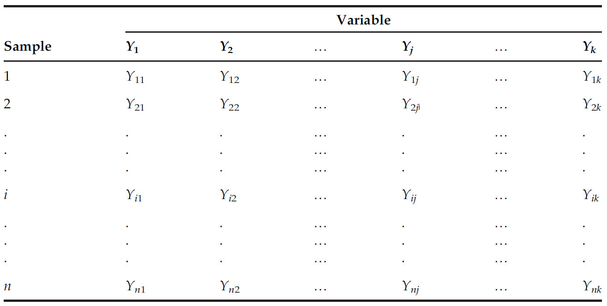

## Target Outcomes

1.  Know the types of "data" R can store and how to convert one from the other.
2.  Know how R stores "data" in (atomic) vectors, matrices, arrays, lists and data frames which are called R objects.
3.  Know how you can access these stored data.
4.  Know how to perform basic operations on these such as
    a.  Mathematical operations using built-in R functions and custom functions
    b.  String operations in handling "text" or character-type data.
    c.  Operations on other R objects using functions in R.
5.  Learn the pipe `%>%` (or `|>`) operator.
6.  Learn the basics of transforming data using `tidyverse` package.

## Data Types and Data Structures

Data types are akin to the *state* of matter (e.g. solid, liquid, gas, etc).

Using R without getting a deeper understanding of them is like a practicing lawyer who, in the first place, have not graduated from law school.

The following are the most common data types in R:

1.  `character` or `chr`

    ```{r}
    "I am Rey. Nice to meet you. April 14, 2025 $15.00"
    typeof("I am Rey. Nice to meet you. April 14, 2025 $15.00")
    ```

2.  `double` or `dbl`

    ```{r}
    2
    3.14
    pi

    typeof(2)
    typeof(pi)
    ```

3.  `integer` or `int`

    ```{r}
    2L
    typeof(2L)
    ```

4.  `logical` or `lgl`

    ```{r}
    TRUE
    FALSE
    T
    F
    typeof(T)
    typeof(FALSE)
    ```

5.  `factor` or `fct`

    ```{r}
    factor("A")
    class(factor("A"))
    ```

The most common format of data format handled in pure sciences are in tabular form. Consider the following:

**Table 1.1** The Configuration of $n$ Samples and $k$ Variables in Multivariate Form

{fig-align="center" width="95%"}

A typical example of such data is as follows.

::: callout-tip
## Example 1. ASSESSMENT OF SURFACE WATER

An assessment of water quality in the Juru and Jejawi Rivers in the Penang State of Malaysia was conducted by monitoring 10 physiochemical parameters; namely, the electrical conductivity (EC) and temperature were measured employing an HACH portable pH meter, and dissolved oxygen (DO) was measured with a YSI 1000 DO meter. The chemical oxygen demand (COD), biochemical oxygen demand (BOD), total phosphate concentrations, and total nitrate were analyzed employing a spectrophotometer (HACH/2010). The turbidity was measured employing a nephelometer. The total suspended solids (TSS) were analyzed gravimetrically in the laboratory. The APHA Standard Methods for the Examination of Water and Wastewater were applied to analyze the concentration of the abovementioned parameters. The data obtained from 10 different sites are each given in Table 1 below.

In this example, 20 samples (rows) are collected from the Juru and Jejawi Rivers ( 10 different sites each), and 10 physiochemical parameters (columns) are measured from each sample. It is very difficult for the researchers to make a decision about the pollution status of the rivers or about the behavior of the different parameters based on the chosen parameters under study because there are many different values, and the differences (fluctuations) between the values of the parameters from sample to sample will mislead the researcher, making it difficult to make a correct decision. Thus, these data should be analyzed employing an appropriate multivariate method that meets the objective of the study to untangle the information and to understand the body of the phenomenon. The objectives of this research were to determine the range of similarity among the sampling sites, to recognize the variables responsible for spatial differences in river water quality, to determine the unobserved factors while demonstrating the framework of the database, and to quantify the effect of possible natural and anthropogenic sources of the chosen water parameters of the rivers.

**Table 1**\
*Physiochemical Parameters for the Juru and Jejawi Rivers*

| Location | Temperature | PH | DO | BOD | COD | TSS | EC | Turbidity | Total phosphate | Total nitrate |
|-------|-------|-------|-------|-------|-------|-------|-------|-------|-------|-------|
| Juru | 28.15 | 7.88 | 6.73 | 10.56 | 1248.00 | 473.33 | 42.45 | 13.05 | 0.88 | 12.45 |
| Juru | 28.20 | 7.92 | 6.64 | 10.06 | 992.50 | 461.67 | 42.75 | 14.11 | 0.55 | 15.05 |
| Juru | 28.35 | 7.41 | 5.93 | 6.01 | 1265.00 | 393.34 | 29.47 | 25.95 | 0.88 | 15.80 |
| Juru | 28.40 | 7.84 | 6.23 | 14.57 | 1124.00 | 473.34 | 42.35 | 22.00 | 1.26 | 12.45 |
| Juru | 28.30 | 7.86 | 6.29 | 7.36 | 1029.50 | 528.34 | 40.70 | 12.36 | 0.61 | 12.90 |
| Juru | 28.30 | 7.89 | 6.36 | 5.27 | 775.00 | 458.33 | 42.50 | 17.90 | 1.01 | 19.25 |
| Juru | 28.55 | 7.40 | 5.67 | 4.81 | 551.00 | 356.67 | 29.51 | 27.70 | 1.02 | 25.55 |
| Juru | 28.75 | 7.41 | 5.26 | 4.96 | 606.00 | 603.33 | 28.45 | 29.35 | 0.84 | 17.90 |
| Juru | 29.30 | 7.25 | 4.18 | 6.61 | 730.00 | 430.00 | 26.25 | 35.35 | 0.73 | 12.85 |
| Juru | 29.55 | 7.18 | 5.14 | 5.11 | 417.00 | 445.00 | 25.79 | 27.75 | 0.72 | 17.15 |
| Jejawi | 27.80 | 7.40 | 4.96 | 36.65 | 82.35 | 815.00 | 29.55 | 1.01 | 1074.00 | 10.51 |
| Jejawi | 27.70 | 7.53 | 5.86 | 37.20 | 122.90 | 858.34 | 21.80 | 0.77 | 947.50 | 6.31 |
| Jejawi | 27.85 | 7.45 | 5.52 | 41.50 | 46.35 | 823.34 | 27.55 | 1.12 | 1194.50 | 7.36 |
| Jejawi | 27.85 | 7.41 | 5.27 | 36.75 | 52.65 | 821.67 | 16.45 | 0.46 | 988.50 | 5.87 |
| Jejawi | 27.65 | 7.27 | 5.71 | 37.95 | 99.95 | 736.67 | 21.10 | 1.01 | 653.00 | 16.36 |
| Jejawi | 27.85 | 7.36 | 5.16 | 34.85 | 36.30 | 373.34 | 11.50 | 0.73 | 911.00 | 11.26 |
| Jejawi | 27.85 | 7.37 | 5.08 | 37.05 | 33.50 | 385.00 | 13.35 | 0.71 | 632.00 | 3.75 |
| Jejawi | 27.75 | 7.40 | 5.23 | 37.10 | 36.35 | 403.34 | 10.85 | 0.57 | 787.00 | 3.31 |
| Jejawi | 27.70 | 7.38 | 5.30 | 38.30 | 30.00 | 550.00 | 13.90 | 0.75 | 879.50 | 3.15 |
| Jejawi | 27.65 | 7.36 | 5.17 | 38.40 | 26.15 | 363.34 | 12.65 | 0.62 | 1339.00 | 8.56 |

Some organisms thrive where industrial waste is evident. Others appear in cleaner zones. Researchers can compare these species counts with the physiochemical parameters to identify connections.

-   Counts in each row reflect a possible sampling for that site.
-   Zero values indicate no observed presence of that species.

**Table 2**.\
*Observed counts of five hypothetical species at each sampling site in the Juru and Jejawi Rivers. Zero values indicate the species is absent, while positive integers represent observed presence.*

| Location  | Species A | Species B | Species C | Species D | Species E |
|-----------|-----------|-----------|-----------|-----------|-----------|
| Juru 1    | 2         | 0         | 5         | 7         | 3         |
| Juru 2    | 1         | 3         | 0         | 10        | 2         |
| Juru 3    | 0         | 2         | 6         | 2         | 4         |
| Juru 4    | 5         | 5         | 0         | 8         | 1         |
| Juru 5    | 3         | 4         | 2         | 0         | 5         |
| Juru 6    | 0         | 3         | 1         | 6         | 6         |
| Juru 7    | 4         | 6         | 3         | 0         | 1         |
| Juru 8    | 1         | 0         | 9         | 2         | 2         |
| Juru 9    | 2         | 4         | 0         | 7         | 3         |
| Juru 10   | 0         | 1         | 4         | 5         | 0         |
| Jejawi 1  | 4         | 2         | 6         | 8         | 0         |
| Jejawi 2  | 3         | 0         | 2         | 0         | 4         |
| Jejawi 3  | 0         | 7         | 5         | 2         | 3         |
| Jejawi 4  | 5         | 5         | 0         | 1         | 0         |
| Jejawi 5  | 1         | 1         | 6         | 9         | 2         |
| Jejawi 6  | 3         | 2         | 0         | 4         | 4         |
| Jejawi 7  | 0         | 8         | 1         | 0         | 5         |
| Jejawi 8  | 6         | 0         | 0         | 3         | 2         |
| Jejawi 9  | 2         | 5         | 3         | 6         | 0         |
| Jejawi 10 | 1         | 0         | 2         | 4         | 6         |
:::

-   Now, the `Location` columns on Tables 1 and 2 are treated as either `character` or `factor`.

    ```{r}
    loc <- c(rep("Juru", 10), rep("Jejawi", 10))
    loc_spp <- c(paste("Juru", 1:10), paste("Jejawi", 1:10))

    loc_fct <- as.factor(c(rep("Juru", 10), rep("Jejawi", 10)))
    loc_spp_fct <- as.factor(loc_spp)

    typeof(loc)
    typeof(loc_spp)

    class(loc_spp_fct)     # class check
    is.factor(loc_spp_fct) # to check if its a factor
    levels(loc_spp_fct)    # factor levels
    ```

-   Species counts in Table 2 are treated as `integer` (but oftentimes, it can also be treated as `double`).

    ```{r}
    SpeciesA <- c(2,1,0,5,3,0,4,1,2,0,4,3,0,5,1,3,0,6,2,1)
    SpeciesB <- c(0,3,2,5,4,3,6,0,4,1,2,0,7,5,1,2,8,0,5,0)
    SpeciesC <- c(5,0,6,0,2,1,3,9,0,4,6,2,5,0,6,0,1,0,3,2)
    SpeciesD <- c(7,10,2,8,0,6,0,2,7,5,8,0,2,1,9,4,0,3,6,4)
    SpeciesE <- as.integer(c(3,2,4,1,5,6,1,2,3,0,0,4,3,0,2,4,5,2,0,6))

    typeof(SpeciesA)
    typeof(SpeciesE)
    ```

-   Except for the `Location` column, all the other columns in Table 1 are treated as `double`.

    ```{r}
    temperature <- c(28.15, 28.20, 28.35, 28.40, 28.30, 28.30, 28.55, 28.75, 29.30, 29.55,
                     27.80, 27.70, 27.85, 27.85, 27.65, 27.85, 27.85, 27.75, 27.70, 27.65)
    pH <- c(7.88, 7.92, 7.41, 7.84, 7.86, 7.89, 7.40, 7.41, 7.25, 7.18,
            7.40, 7.53, 7.45, 7.41, 7.27, 7.36, 7.37, 7.40, 7.38, 7.36)
    DO <- c(6.73, 6.64, 5.93, 6.23, 6.29, 6.36, 5.67, 5.26, 4.18, 5.14,
            4.96, 5.86, 5.52, 5.27, 5.71, 5.16, 5.08, 5.23, 5.30, 5.17)
    BOD <- c(10.56, 10.06, 6.01, 14.57, 7.36, 5.27, 4.81, 4.96, 6.61, 5.11,
             36.65, 37.20, 41.50, 36.75, 37.95, 34.85, 37.05, 37.10, 38.30, 38.40)
    COD <- c(1248, 992.5, 1265, 1124, 1029.5, 775, 551, 606, 730, 417,
             82.35, 122.90, 46.35, 52.65, 99.95, 36.30, 33.50, 36.35, 30.00, 26.15)
    TSS <- c(473.33, 461.67, 393.34, 473.34, 528.34, 458.33, 356.67, 603.33, 430.00, 445.00,
             815.00, 858.34, 823.34, 821.67, 736.67, 373.34, 385.00, 403.34, 550.00, 363.34)
    EC <- c(42.45, 42.75, 29.47, 42.35, 40.70, 42.50, 29.51, 28.45, 26.25, 25.79,
            29.55, 21.80, 27.55, 16.45, 21.10, 11.50, 13.35, 10.85, 13.90, 12.65)
    Turbidity <- c(13.05, 14.11, 25.95, 22.00, 12.36, 17.90, 27.70, 29.35, 35.35, 27.75,
                   1.01, 0.77, 1.12, 0.46, 1.01, 0.73, 0.71, 0.57, 0.75, 0.62)
    Total_phosphate <- c(0.88, 0.55, 0.88, 1.26, 0.61, 1.01, 1.02, 0.84, 0.73, 0.72,
                         1074.00, 947.50, 1194.50, 988.50, 653.00, 911.00, 632.00, 787.00, 879.50, 1339.00)
    Total_nitrate <- c(12.45, 15.05, 15.80, 12.45, 12.90, 19.25, 25.55, 17.90, 12.85, 17.15,
                       10.51, 6.31, 7.36, 5.87, 16.36, 11.26, 3.75, 3.31, 3.15, 8.56)
    ```

In the previous examples, `BOD`, `COD`, `DO`, `EC`, `loc`, `loc_spp`, `loc_spp_fct`, `pH`, `SpeciesA`, `SpeciesB`, `SpeciesC`, `SpeciesD`, `SpeciesE`, `temperature`, `Total_nitrate`, `Total_phosphate`, `TSS`, and `Turbidity` are called **variable names** that stores the different data types.

These so-called variables are actually stored in R formally as an object called **(atomic) vectors**, one of the *data structure* in R:

a.  **Vectors** hold elements of the same type. Example: `c(1,2,3)` or `c("A","B","C")`.
b.  **Matrices** hold elements of the same type in 2D form. Example: `matrix(1:6, nrow=2, ncol=3)`.
c.  **Arrays** extend matrices to more dimensions.
d.  **Lists** hold elements of different types. Example: `list("Hello", 42, TRUE)`.
e.  **Data Frames** hold tabular data with columns that can be different data types. Most data analysis starts with data frames.

The Table 1 before can be stored into a `data.frame` using the variable names (**atomic vector**) we created before as follows:

```{r}
water_data <- data.frame(
  Location = loc,
  Temperature = temperature,
  pH = pH,
  DO = DO,
  BOD = BOD,
  COD = COD,
  TSS = TSS,
  EC = EC,
  Turbidity = Turbidity,
  Total_phosphate = Total_phosphate,
  Total_nitrate = Total_nitrate
)

water_data
```

Table 2 can also stored as `data.frame` as shown:\

```{r}
species_data <- data.frame(
  Location = loc_spp,
  SpeciesA = SpeciesA,
  SpeciesB = SpeciesB,
  SpeciesC = SpeciesC,
  SpeciesD = SpeciesD,
  SpeciesE = SpeciesE
)

species_data
```

If the focus is a species counts while retaining the location and species names, we can write it as a `matrix`:

```{r}
spp_matrix <- cbind(
  SpeciesA = SpeciesA,
  SpeciesB = SpeciesB,
  SpeciesC = SpeciesC,
  SpeciesD = SpeciesD,
  SpeciesE = SpeciesE
)

spp_matrix

rownames(spp_matrix) <- loc_spp

spp_matrix
```

## Accessing Stored Data

-   Use `[]` to index. For vectors, `my_vector[2]` gets the second element.\
-   For data frames, `data_frame$column_name` extracts a column.\
-   Use `[[ ]]` to extract single elements, especially from lists.

## Basic Operations

-   **Mathematical operations**: Functions like `mean()`, `min()`, and `max()` apply to numeric objects. Custom functions can be defined with `my_function <- function(x){...}`.\
-   **String operations**: `paste()`, `str_c()`, and `str_to_upper()` help handle character data.\
-   **Operations on data frames**: Summaries like `summary()`, merging with `left_join()`, subsetting rows with `filter()`.
